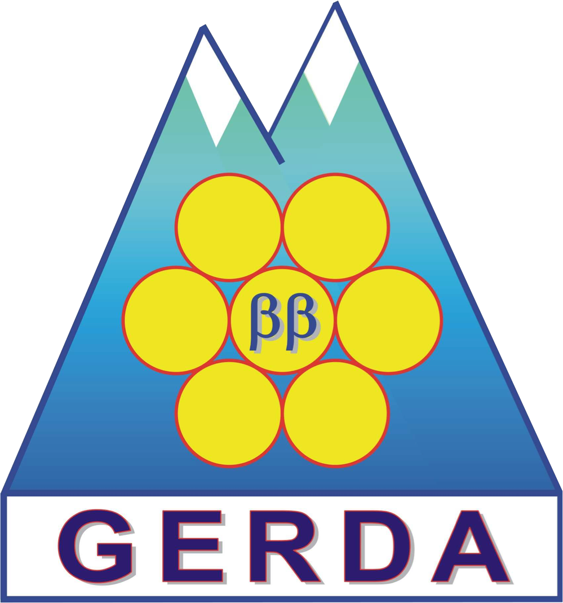

# gerda-gems-db

GeMS database for GERDA MaGe simulations.

The aim of this repository is to provide a mirror (without actual data files)
of the `/lfs/l2/gerda/gerda-simulations/gems-db` folder at the
`lfs2.mpi-hd.mpg.de` Heidelberg cluster (MPIK) containing official Monte Carlo
simulations of background contaminations for GERDA. It can be easily browsed to
check the current status of the simulations (what has been simulated and what
has not) and inspect the MaGe macro files. The repository is filled with
READMEs reporting all valuable informations for the sake of reproducibility.

**The simulation you need isn't listed here?** Submit a Pull Request!

### GERDA PDFs
We distribute the official Probability Density Functions as a tarball that you
can download from the [gerda-pdfs releases
page](https://github.com/mppmu/gerda-pdfs/releases). The archive is organized
like this repository: you'll find a ROOT file for each `volume/part/isotope`
simulation, each file contains a set of histograms. Refer to
[GSTR-18-009](https://www.mpi-hd.mpg.de/gerda/internal/GSTR/GSTR-18-009.pdf)
for a description of what each histogram represents. We also distribute, for
convenience, the GERDA data for which the PDFs are built, with the same
histogram format, as a separate tarball in the releases page. Find
[here](src/data-prod) the software that we use to produce it.

In general you can consult
[GSTR-18-009](https://www.mpi-hd.mpg.de/gerda/internal/GSTR/GSTR-18-009.pdf)
for any further documentation (it could be outdated though).
[Here](https://github.com/mppmu/gerda-snippets/tree/master/MaGe-macros) you
find a reference macro file for MaGe.

Maintainers:
* Katharina von Sturm - [vonsturm@pd.infn.it](mailto:vonsturm@pd.infn.it)
* Luigi Pertoldi - [luigi.pertoldi@pd.infn.it](mailto:luigi.pertoldi@pd.infn.it)

### Useful links
* [gerda-gems-sw](https://github.com/mppmu/gerda-gems-sw)
* [gerda-pdfs](https://github.com/mppmu/gerda-pdfs)
* [(outdated) documentation](https://www.mpi-hd.mpg.de/gerda/internal/GSTR/GSTR-18-009.pdf)
* [Germanium detectors sampled surfaces](gedet/surf_chanwise/ver)
* [(GERDA) MaGe source code repository](https://github.com/mppmu/MaGe/tree/gerda-optical)
